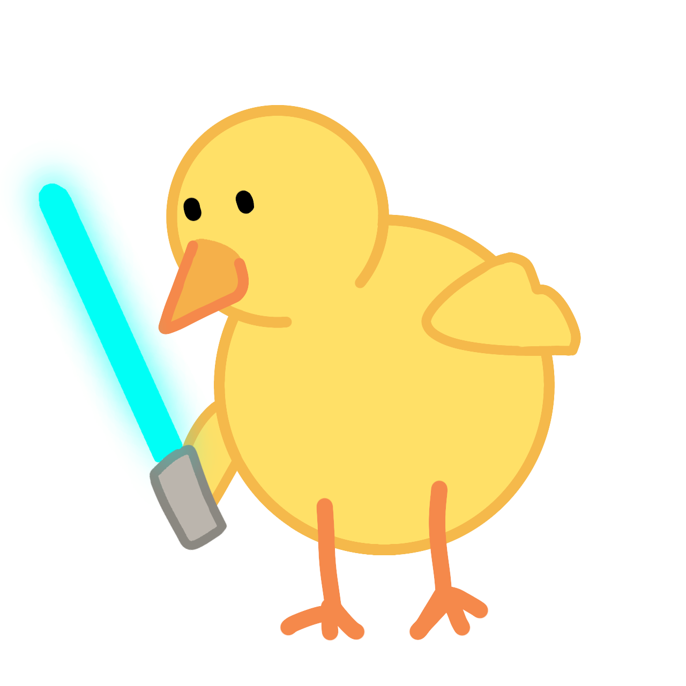
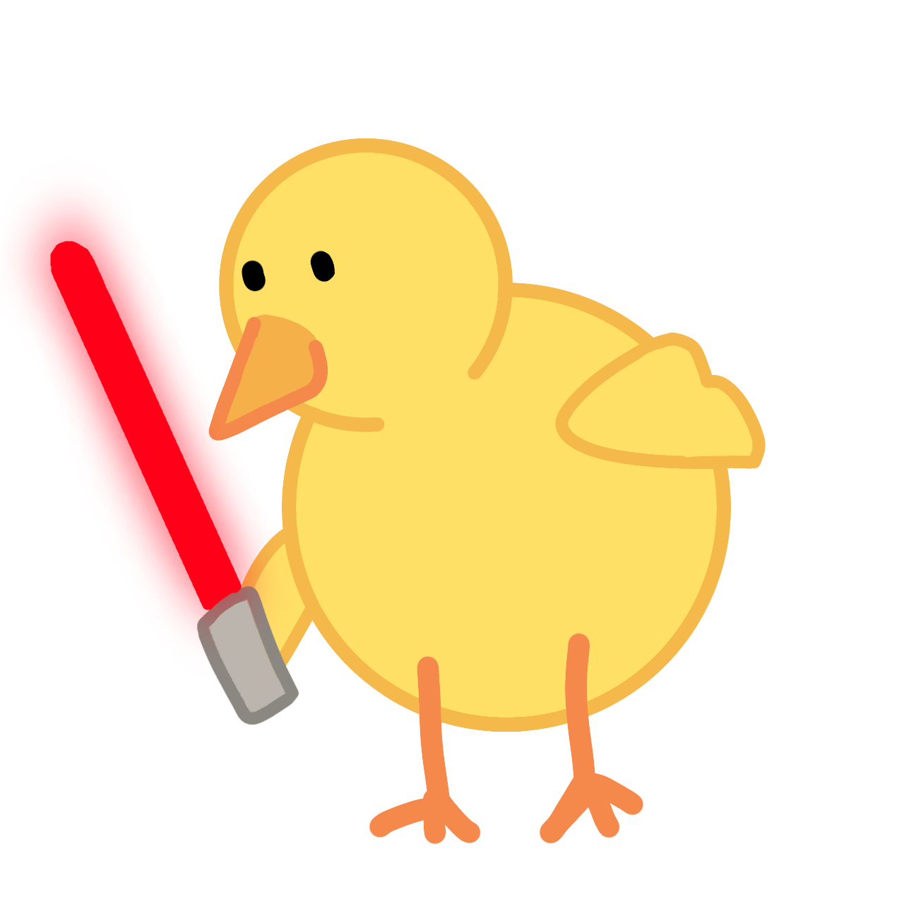

# Piou Piou Gaming 




<!-- Version en Anglais -->
<details>
<summary> 🇬🇧 English version</summary>

### <u>Summary</u> : 
<a href="#Description"> Description and Organization</a> <br>
<a href="#Install"> Install the project </a> <br>
<a href="#Thanks"> Special Thanks </a> <br>

## <div id="Description">Description and Organization</div>
## <div id="Install">Install the project</div>

```
git clone git@github.com:FARVACQUE-L/hackathon-starwarslove.git

cd hackathon-starwarslove

npm install

npm run dev
```

## <div id="Thanks">Special Thanks</div>

Special Thanks to wooloo !
</details>


<!-- Version en Francais -->
<details open>
<summary> 🇫🇷 Version française</summary>

### <u>Sommaire</u> : 
<a href="#Description"> Description et organisation</a> <br>
<a href="#Installer"> Installer/ Executer le projet </a> <br>
<a href="#Remerciment"> Remerciment </a> <br>

## <div id="Description">Description et organisation</div>
## <div id="Installer">Installer le projet</div>

```
git clone git@github.com:FARVACQUE-L/hackathon-starwarslove.git

cd hackathon-starwarslove

npm install

npm run dev
```

## <div id="Remerciment">Remerciment</div>

Grand merci à moumouton
</details>

